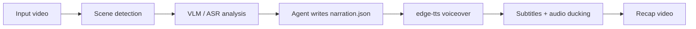

# video-recap

[中文说明](README.zh-CN.md) · English

> A Claude Code skill for turning videos into Chinese narrated recap videos — with scene analysis, agent-written narration, TTS voiceover, subtitles, and dynamic audio mixing.

[](LICENSE)


## Demo

https://github.com/user-attachments/assets/92698ec6-0d23-4f9f-8825-c3684ef57aff

## What is it?

`video-recap` is a Claude Code skill that helps an agent create short-form Chinese recap videos from existing video files.



## Why use it?

- **Agent-written narration** — the agent reads visual/ASR artifacts and writes the script with story intent.
- **Default Chinese voiceover** — prefers `edge-tts` with the default voice `zh-CN-YunxiNeural`.
- **Scene-aware analysis** — uses ffmpeg scene detection plus VLM descriptions and frame facts.
- **Original audio preserved** — narration is mixed over source audio with ducking instead of replacing everything.
- **Resumable workflow** — intermediate artifacts are saved so you can revise narration without starting over.
- **OpenAI-compatible VLM endpoint** — works with compatible providers through `OPENAI_API_URL`.

## Installation

### 1. Install the Claude Code skill

Ask Claude Code:

```text
Install this skill: https://github.com/worldwonderer/video-recap
```

### 2. Install runtime dependencies

```bash
brew install ffmpeg
pip3 install edge-tts
```

### 3. Configure an OpenAI-compatible API

```bash
export OPENAI_API_KEY=your-key
export OPENAI_API_URL=https://your-api-url/v1
export OPENAI_MODEL=doubao-seed-2-0-lite-260428

# Recommended when your proxy/provider is sensitive to concurrent VLM requests:
export VLM_WORKERS=1
```

## Quick start

After installing the skill, tell Claude Code:

```text
Create a Chinese recap video for /path/to/video.mp4 using video-recap.
Use edge-tts with the Yunxi voice. Context: <show / movie / character background>.
```

The pipeline prepares scene, ASR, and visual-analysis artifacts, then pauses with an `agent_narration_brief.md`. The agent writes `narration.json`, and the CLI resumes to synthesize voiceover and assemble the video.

If you want to start the first analysis pass manually:

```bash
python3 skills/video-recap/scripts/video_recap.py /path/to/video.mp4 \
  --tts edge-tts \
  --voice zh-CN-YunxiNeural \
  --context "show name, characters, or story background"
```

The command pauses before TTS and prints a `work_dir`. Read `work_dir/agent_narration_brief.md`, write `work_dir/narration.json`, then run the printed resume command.

### Doctor check

```bash
python3 skills/video-recap/scripts/video_recap.py --doctor
```

Use `--doctor-tts-smoke` when you also want a short `edge-tts` synthesis check.

## Output

Typical outputs:

- `recap_<video>.mp4` — final recap video
- `work_dir/subtitles.srt` — generated subtitles
- `work_dir/agent_narration_brief.md` — timing and scene brief for the agent
- `work_dir/narration.json` — agent-written narration script
- `work_dir/vlm_analysis.json` — scene-level visual analysis
- `work_dir/asr_result.json` — ASR result when available
- `work_dir/tts_segments/` — generated TTS audio segments

## Useful references

- [Skill contract](skills/video-recap/SKILL.md)
- [Agent workflow](skills/video-recap/references/agent-mode-workflow.md)
- [Parameters](skills/video-recap/references/parameters.md)
- [Prompt templates](skills/video-recap/references/prompt-templates.md)
- [Resume and partial reruns](skills/video-recap/references/pipeline-resume.md)
- [Data schema](skills/video-recap/references/data-schema.md)

## Acknowledgements

- [linux.do](https://linux.do)
- [qwen3-asr-rs](https://github.com/alan890104/qwen3-asr-rs)

## License

MIT — see [LICENSE](LICENSE).
