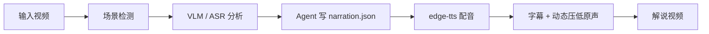

# video-recap

中文说明 · [English](README.md)

> 一个 Claude Code skill：把输入视频制作成中文解说 / recap 视频。自动完成场景分析、Agent 写解说词、TTS 配音、字幕与动态混音。

[](LICENSE)


## 效果预览

https://github.com/user-attachments/assets/92698ec6-0d23-4f9f-8825-c3684ef57aff

## 这是什么？

`video-recap` 是一个 Claude Code skill，用来把已有视频制作成中文短视频解说 / recap。



## 为什么用它？

- **Agent 亲自写解说词**：Agent 读取画面、对白和上下文后写脚本，更像真正的解说创作。
- **默认中文配音**：优先使用 `edge-tts`，默认音色 `zh-CN-YunxiNeural`。
- **场景感知分析**：基于 ffmpeg 场景检测、VLM 描述和帧级事实生成分析素材。
- **保留原声质感**：不是替换原音频，而是在解说时动态压低原声。
- **可断点续跑**：中间结果持久化，改解说词后不用从头跑。
- **兼容 OpenAI 格式接口**：通过 `OPENAI_API_URL` 使用兼容的 VLM 服务。

## 安装

### 1. 安装 Claude Code skill

直接告诉 Claude Code：

```text
安装这个 skill https://github.com/worldwonderer/video-recap
```

### 2. 安装运行依赖

```bash
brew install ffmpeg
pip3 install edge-tts
```

### 3. 配置 OpenAI 兼容 API

```bash
export OPENAI_API_KEY=your-key
export OPENAI_API_URL=https://your-api-url/v1
export OPENAI_MODEL=doubao-seed-2-0-lite-260428

# 如果代理或服务商对 VLM 并发敏感，建议串行：
export VLM_WORKERS=1
```

## 快速开始

安装 skill 后，在 Claude Code 里说：

```text
用 video-recap 为 /path/to/video.mp4 生成中文解说视频。
使用 edge-tts 和 Yunxi 音色。背景：<节目 / 电影 / 角色信息>。
```

Pipeline 会准备场景、ASR、VLM 分析素材，然后生成 `agent_narration_brief.md` 并暂停。Agent 读取 brief 后写 `narration.json`，CLI 再续跑 TTS 与视频组装。

如果你想手动启动前置分析：

```bash
python3 skills/video-recap/scripts/video_recap.py /path/to/video.mp4 \
  --tts edge-tts \
  --voice zh-CN-YunxiNeural \
  --context "节目名、角色名、剧情背景"
```

命令会在 TTS 前暂停并输出 `work_dir`。读取 `work_dir/agent_narration_brief.md`，写入 `work_dir/narration.json` 后，再执行打印出的续跑命令。

### Doctor 自检

```bash
python3 skills/video-recap/scripts/video_recap.py --doctor
```

如果还想测试 `edge-tts` 能否真实合成一小段音频，加 `--doctor-tts-smoke`。

## 输出文件

常见输出：

- `recap_<video>.mp4`：最终解说视频
- `work_dir/subtitles.srt`：生成字幕
- `work_dir/agent_narration_brief.md`：给 Agent 写解说词用的场景与时长 brief
- `work_dir/narration.json`：Agent 写的解说词
- `work_dir/vlm_analysis.json`：场景级视觉分析
- `work_dir/asr_result.json`：可用时的 ASR 转写结果
- `work_dir/tts_segments/`：分段 TTS 音频

## 参考文档

- [Skill 说明](skills/video-recap/SKILL.md)
- [Agent 模式工作流](skills/video-recap/references/agent-mode-workflow.md)
- [参数参考](skills/video-recap/references/parameters.md)
- [Prompt 模板](skills/video-recap/references/prompt-templates.md)
- [断点续跑与局部重跑](skills/video-recap/references/pipeline-resume.md)
- [数据结构](skills/video-recap/references/data-schema.md)

## 致谢

- [linux.do](https://linux.do)
- [qwen3-asr-rs](https://github.com/alan890104/qwen3-asr-rs)

## License / 许可证

MIT — see [LICENSE](LICENSE)。
